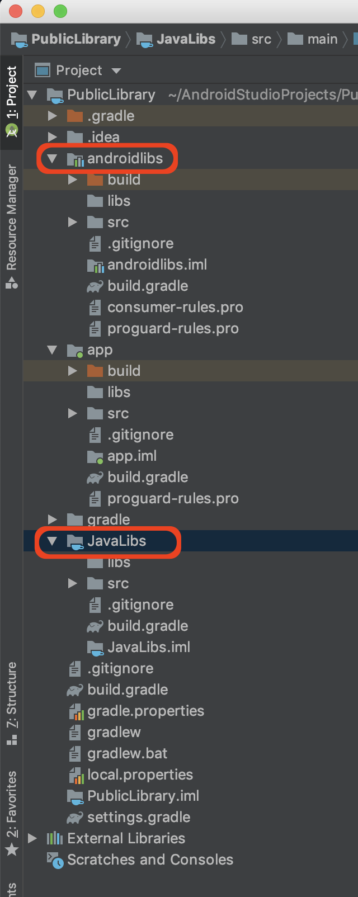

本工程用来演示将代码放在Github上，制作成公开库，可通过gradle引用来使用。以下是操作过程记录：

（1）新建一个Android Studio的Android工程；

（2）在工程中新建一个Android Library类型的Module，此处以AndroidLibs为例；一个Java Library类型的Module，此处以JavaLibs为例；



（3）在工程的根build.gradle对应位置添加 

```
buildscript { 
  dependencies {
    classpath 'com.github.dcendents:android-maven-gradle-plugin:2.1' // Add this line
  }
```

(4) 在AndroidLibs Module的build.gradle中对应位置添加

```
 apply plugin: 'com.github.dcendents.android-maven'  

 group='com.github.YourUsername'
```

（5）